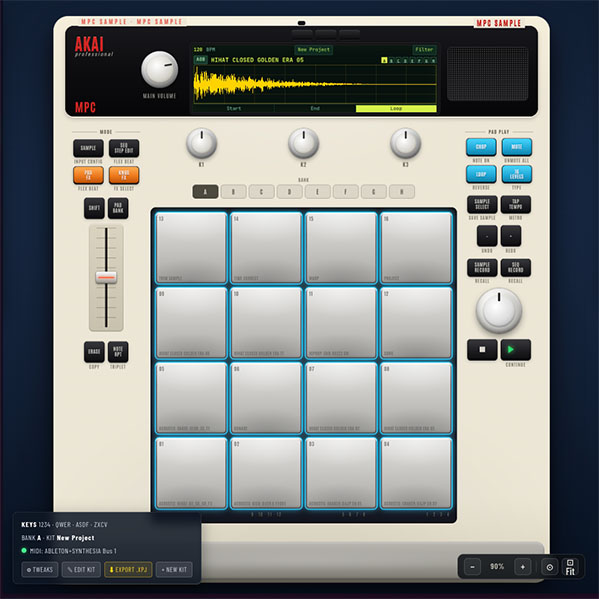

# MPC Sample

A web and desktop app for managing Akai MPC sample projects and building drum kits. Load your existing MPC kits, preview samples on a familiar pad layout, rearrange and customize your pads, then export the result as a ready-to-use `.xpj` project file — drop it straight onto your MPC hardware or SD card and your kit is ready to play.

Runs as a browser app or as a packaged macOS desktop app (Electron). The desktop build adds native file dialogs for opening and saving `.xpj` files and direct SD card workflow support.



For a live demo visit [mpcsample.app](mpcsample.app)

---

## Requirements

- Node.js >= 18
- npm

---

## Setup

```bash
git clone <repo-url>
cd mpcsample
npm install
```

---

## Running

**Browser only (Vite, port 4404):**

```bash
npm run dev
```

**Full Electron desktop app (renderer on port 4406):**

```bash
npm run electron:dev
```

**Package a distributable (macOS):**

```bash
npm run electron:dist
```

---

## macOS Note

The app is not code-signed or notarized. macOS Gatekeeper will block it from opening after download. There are two ways to get past this.

### Easiest — right-click to open (one-time)

1. Right-click (or Control-click) **MPC Sample.app**
2. Choose **Open** from the context menu
3. Click **Open** in the dialog that appears

macOS remembers this decision; the app opens normally from then on.

### Via Terminal — remove the quarantine flag

If the right-click method doesn't work, or if you prefer the command line, remove the quarantine extended attribute directly.

**On the `.app` after dragging it to `/Applications`:**

```bash
xattr -dr com.apple.quarantine "/Applications/MPC Sample.app"
```

**On a freshly extracted `.app` before moving it:**

```bash
xattr -cr "MPC Sample.app"
```

Run either command once; no further steps are needed.

---

## Disclaimer

_MPC Sample.app is an independent, community-built tool and is not affiliated with, endorsed by, or sponsored by inMusic Brands, Inc. or its subsidiaries. "MPC" and "Akai Professional" are registered trademarks of inMusic Brands, Inc. All trademarks are the property of their respective owners._
