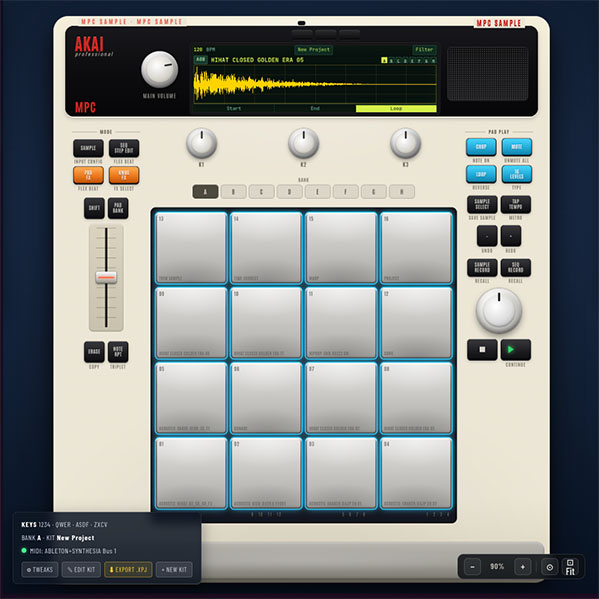

# MPC Sample

A web and desktop app for managing Akai MPC sample projects and building drum kits. Load your existing MPC kits, preview samples on a familiar pad layout, rearrange and customize your pads, then export the result as a ready-to-use `.xpj` project file — drop it straight onto your MPC hardware or SD card and your kit is ready to play.

Runs as a browser app or as a packaged macOS desktop app (Electron). The desktop build adds the sample library browser, the sample recorder, native file dialogs, and the direct SD card workflow.



For a live demo visit [mpcsample.app](mpcsample.app)

---

## Features

**Kit building**
- Load, browse, and edit existing MPC `.xpj` kits on a familiar 128-pad (8-bank) layout
- Drag-and-drop WAV import onto any pad; move/swap pads; per-pad name, coarse/fine tune, and volume
- Export to a ready-to-use `.xpj` project — drop it straight onto your MPC hardware or SD card

**Sample library browser** (desktop)
- Point it at a local folder of samples (tested with 25k+ files) — fast background scan + waveform thumbnails, with an on-disk cache so repeat scans are instant
- Auto-tagging from folder/filename conventions (Kick, Snare, 808, Loop, Vocal, ...) plus manual tags, pack filtering, and drag-to-pad
- Corrupt/unreadable audio files are automatically hidden rather than shown as silent dead ends

**Step sequencer**
- Live/MIDI-driven pattern recording (1–8 bars, 8th/16th/32nd resolution), per-step velocity, pattern persisted across reloads
- Exports into the project's real, editable native MPC sequence data — not just in-app playback

**Sample recording**
- Record a sample directly from system/app audio (any browser tab, VLC, Plex, ...) with no virtual audio cable — live level meter, waveform preview, click-to-assign to a pad

**Effects rack**
- Stack multiple effects (filter, distortion, bit crusher, chorus, delay, reverb) and render the whole chain through the sample in a single offline pass
- Preview the chain live before committing; fixes the hardware's add-effect → resample → add-next-effect workflow

**MIDI**
- Web MIDI in/out with your MPC Sample hardware — pad hits in both directions, correct bank-shifted note mapping, no special hardware config beyond the device's own MIDI settings

**Desktop app / SD card workflow**
- Writes projects straight to the MPC SD card unzipped (`.xpj` + `_[ProjectData]/*.wav`), no zip/unzip round-trip required
- Auto-detects the mounted SD card by contents (any volume name), with safe eject
- Native open/save `.xpj` dialogs, auto-open export folder

---

## Requirements

- Node.js >= 18
- npm

---

## Setup

```bash
git clone <repo-url>
cd mpcsample
npm install
```

---

## Running

**Browser only (Vite, port 4404):**

```bash
npm run dev
```

**Full Electron desktop app (renderer on port 4406):**

```bash
npm run electron:dev
```

**Package a distributable (macOS):**

```bash
npm run electron:dist
```

---

## macOS Note

The app is not code-signed or notarized. macOS Gatekeeper will block it from opening after download. There are two ways to get past this.

### Easiest — right-click to open (one-time)

1. Right-click (or Control-click) **MPC Sample.app**
2. Choose **Open** from the context menu
3. Click **Open** in the dialog that appears

macOS remembers this decision; the app opens normally from then on.

### Via Terminal — remove the quarantine flag

If the right-click method doesn't work, or if you prefer the command line, remove the quarantine extended attribute directly.

**On the `.app` after dragging it to `/Applications`:**

```bash
xattr -dr com.apple.quarantine "/Applications/MPC Sample.app"
```

**On a freshly extracted `.app` before moving it:**

```bash
xattr -cr "MPC Sample.app"
```

Run either command once; no further steps are needed.

---

## Disclaimer

_MPC Sample.app is an independent, community-built tool and is not affiliated with, endorsed by, or sponsored by inMusic Brands, Inc. or its subsidiaries. "MPC" and "Akai Professional" are registered trademarks of inMusic Brands, Inc. All trademarks are the property of their respective owners._
